# RentCar - Spring MVC Application

My final project for SoftUni.

Project is web application for renting cars.

Tech Stack:

-**Java Spring**

-**MySQL**

-**JavaScript**

-**HTML**

-**CSS**

-**Bootstrap**

---

Application use external API for image hosting https://cloudinary.com/.
The API needs some environment variables to work:

cloudinary:

cloud_name: ${CLOUDINARY_CLOUD_NAME}

api_key: ${CLOUDINARY_API_KEY}

api_secret: ${CLOUDINARY_API_SECRET}

When the project is started an admin user is initialized with username: admin and password: 123456(it can be changed in application.yaml file).
There are 3 types of users: ADMIN,USER and EMPLOYEE.
ADMIN can promote users to EMPLOYEE or demote them.
Admin can add cars, add extras, manage fleet and manage orders.
Employee can manage orders, manage fleet ana make review.
User can book car, make review, delete his own review, view his orders.

Reviews are consumed by another REST microservice (https://github.com/AntonGeorgievGanev/ReviewREST)

---

Index page:
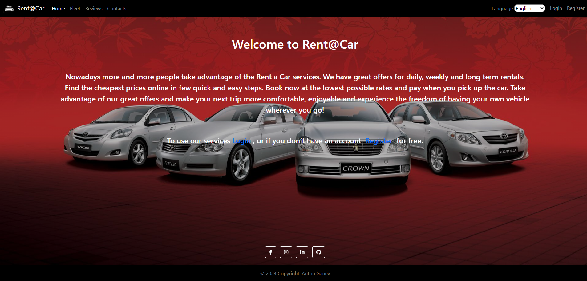

Registration page:
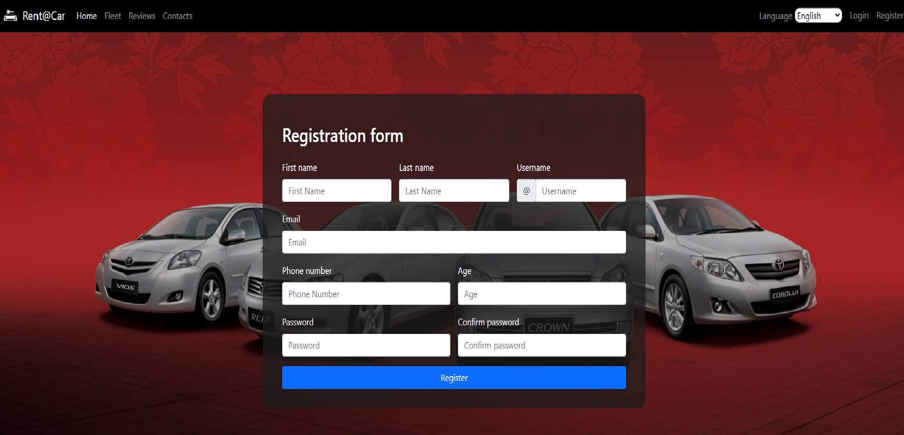

With logged in admin:
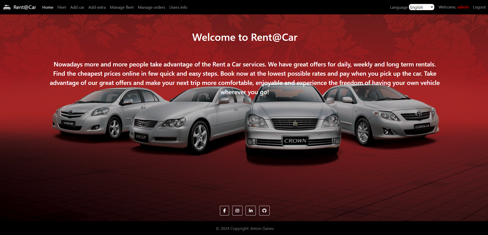

With logged in employee
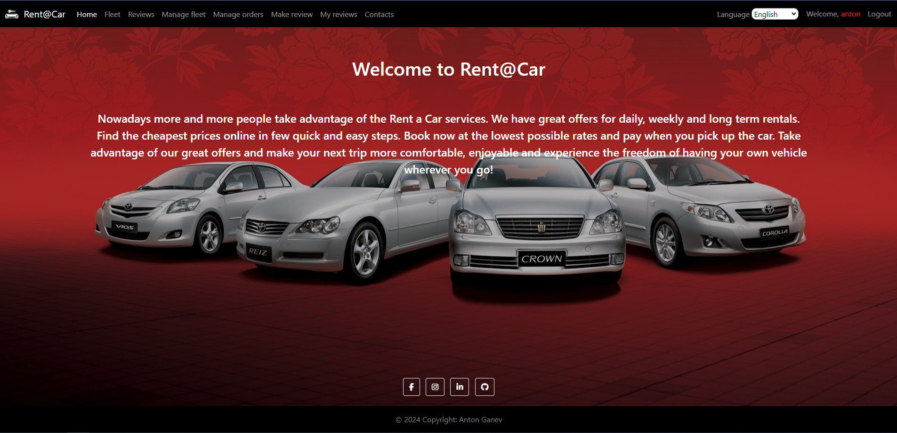

Managing fleet:
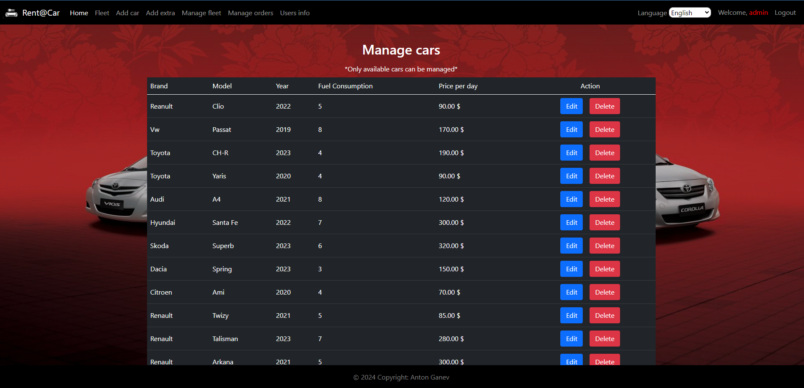
ADMIN and EMPLOYEE can manage fleet.
Edit available cars (not booked) brand, model, year, fuel consumption and price per day.

Managing orders:
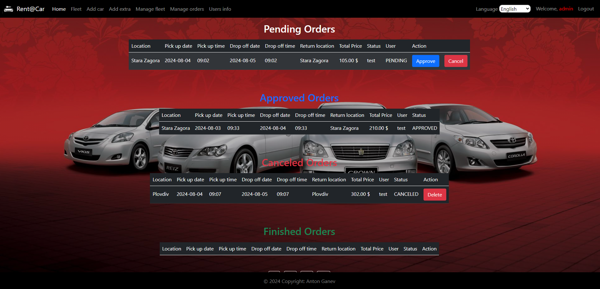
ADMIN and EMPLOYEE can manage fleet.
There are four category of orders depends on their status.
Pending orders can be approved or canceled.
Approved order are automatically finished with scheduler when drop off date and time expired.
Canceled and finished order can be deleted from db.
When an order is approved, canceled or finished the user receive email.

User details:
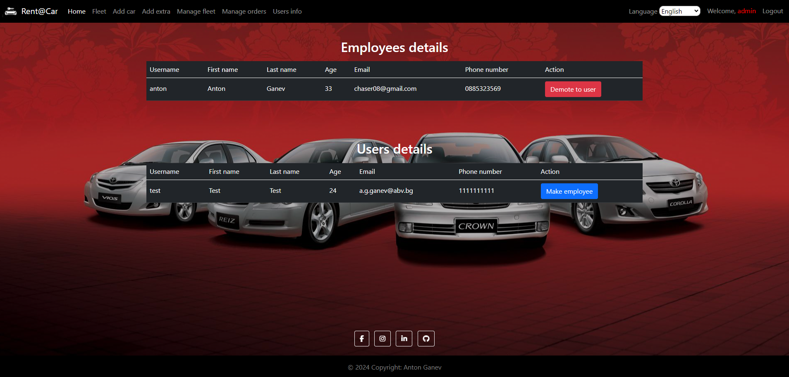
Only ADMIN have access to this section.He can promote user to employee or demote him.

Book a car:
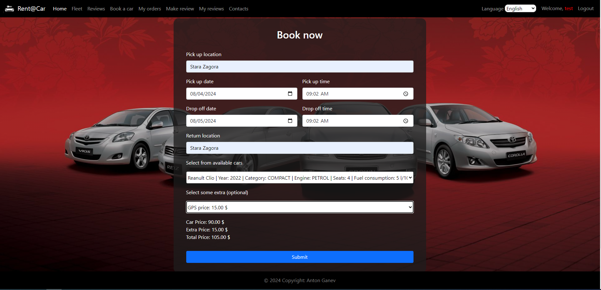
When an order is registered the user receive email.

User orders:
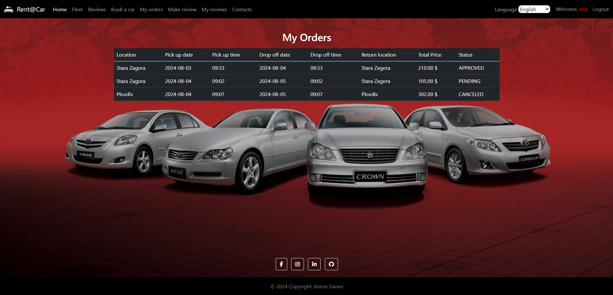
User can see his orders information and status.

User reviews:
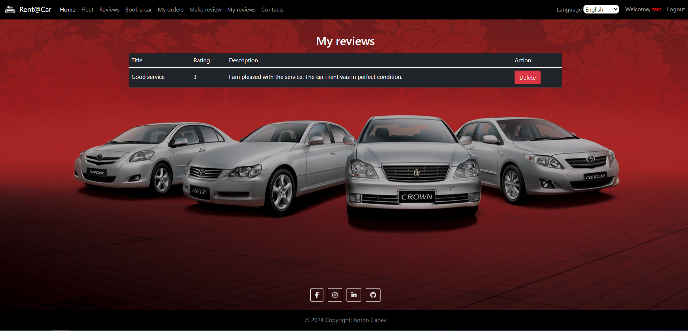
User can delete his reviews.

Fleet:
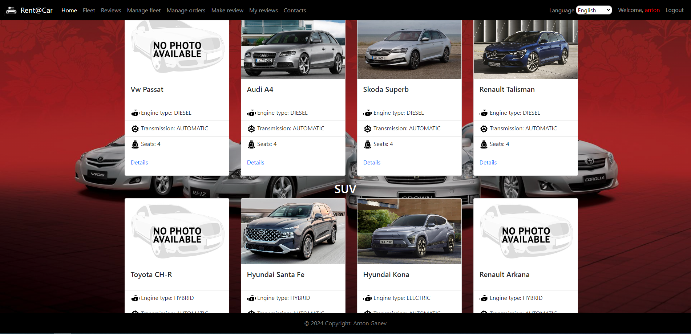

Car details:
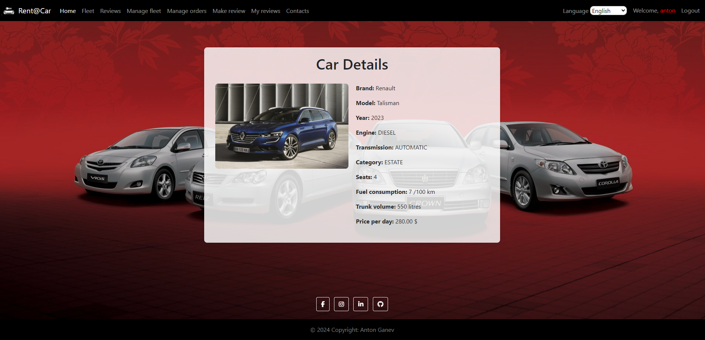
